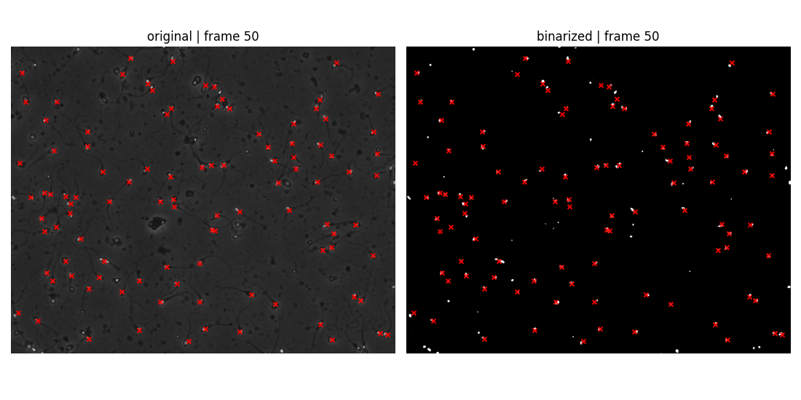

# Example: Default Data + Otsu + YOLO

This is the fastest way to get a realistic pycasa pipeline running. It uses the built-in HC004 default dataset — a publicly available semen analysis video subset — requires no local files, and exercises the unified YOLO detection backend (YOLO26 by default, with YOLOv5 available via `yolo_model="yolov5"`).

## Install

```bash
pip install "pycasa[io,yolo] @ git+https://github.com/DFL-KamLab/pycasa.git"
```

The `yolo` extra pulls in `matplotlib`, which is required for visualization calls.

---

## Script

```python
import pycasa as pc

# Load the default HC004 dataset subset from HuggingFace Hub (cached after first run)
self = pc.io.load_default_data()

# Binarize the video using Otsu global thresholding
self.preprocessing.binarization.otsu()

# Run YOLO inference on every frame (downloads managed YOLO26 weights on first run)
self.detection.yolo()

# Plot a single frame with bounding-box detections overlaid
self.visualization.plot_frame(frame_index=5, show_detections=True)

# Print a session summary
self.info()
```

---

## Output preview

<div class="screenshot" markdown>


*`plot_frame(frame_index=5, show_detections=True)` — YOLOv5 bounding boxes overlaid on frame 5 of the HC004 dataset.*

</div>

---

## Step-by-step breakdown

**`pc.io.load_default_data()`**

Downloads (or reads from the local cache at `~/.pycasa_data`) a subset of the HC004 microscopy video and its matching groundtruth annotation folder. The video is stored as a NumPy array under `casa["video"]["original_video"]` in BGR color order. Sampling rate and frame range are stored in `casa["meta"]`.

**`preprocessing.binarization.otsu()`**

Converts the original video to grayscale first, then applies Otsu's global threshold to produce a binary (0/255 uint8) video stored as `casa["video"]["binary_video"]`. Otsu works well for semen analysis videos because the sperm cells create a bimodal intensity distribution against the bright background.

**`detection.yolo()`**

Runs YOLO inference. By default `yolo_model="yolo26"` and the `sys-casa_yolo26n.pt` weights (trained on CASA semen data) are downloaded from HuggingFace on first run. Each frame's detections — `[class_id, norm_cx, norm_cy, norm_w, norm_h]` — are stored in `casa["detections"]["yolo26"]` (or `casa["detections"]["yolov5"]` when `yolo_model="yolov5"`). Confidence threshold defaults to `0.15`.

**`visualization.plot_frame(frame_index=5, show_detections=True)`**

Opens a static matplotlib figure showing frame 5 of the original video with YOLO bounding boxes overlaid. Useful for a quick visual sanity-check before running the full pipeline.

**`self.info()`**

Prints a compact summary of what the session holds: video arrays loaded, active detections, and key metadata fields.

---

## Otsu binary video

<div class="screenshot" markdown>


*`plot_frame(image_type="original+binarized")` — original frame (left) alongside the Otsu binary output (right).*

</div>

---

## Inspecting the session

```python
# What metadata was recorded?
meta = self.get_meta()
print(meta["sampling_rate"])       # frames per second
print(meta["last_detection"])      # method used, frames processed, detection counts

# How many detections are there per frame?
detections = self.get_detections()
frame_0_dets = detections[0]       # list of [class_id, cx, cy, w, h] rows for frame 0
print(f"Frame 0: {len(frame_0_dets)} detections")

# Compare against groundtruth
gt = self.get_groundtruth()
print(f"Groundtruth frames loaded: {len(gt)}")
```

---

## Notes

- First run may trigger downloads for both the dataset and the YOLO weights. Subsequent runs use the cache and complete offline.
- Calling a second detection method after `yolo()` will overwrite the active predicted detections and emit a warning.
- The `plot_frame` call requires `matplotlib`. If you installed with `[io,yolo]`, it is already included.
- `load_default_data()` auto-sets `um_per_px=0.24` (HSTLI value) so you can jump straight to motility computation without a separate `self.set_um_per_px(...)` call.

---

## What to try next

- Add `self.tracking.sort()` after detection to get trajectories — see [Detection + SORT Tracking](detection-tracking.md).
- Add `self.assessment.evaluate_detections()` to score the YOLO output against the bundled groundtruth detections, or `self.assessment.evaluate_tracks()` to score trackers against imported groundtruth tracks (MOTA / IDF1) — see [Motility + Assessment](motility-assessment.md).
- Swap in your own video — see [Load Custom Video](custom-video.md).
