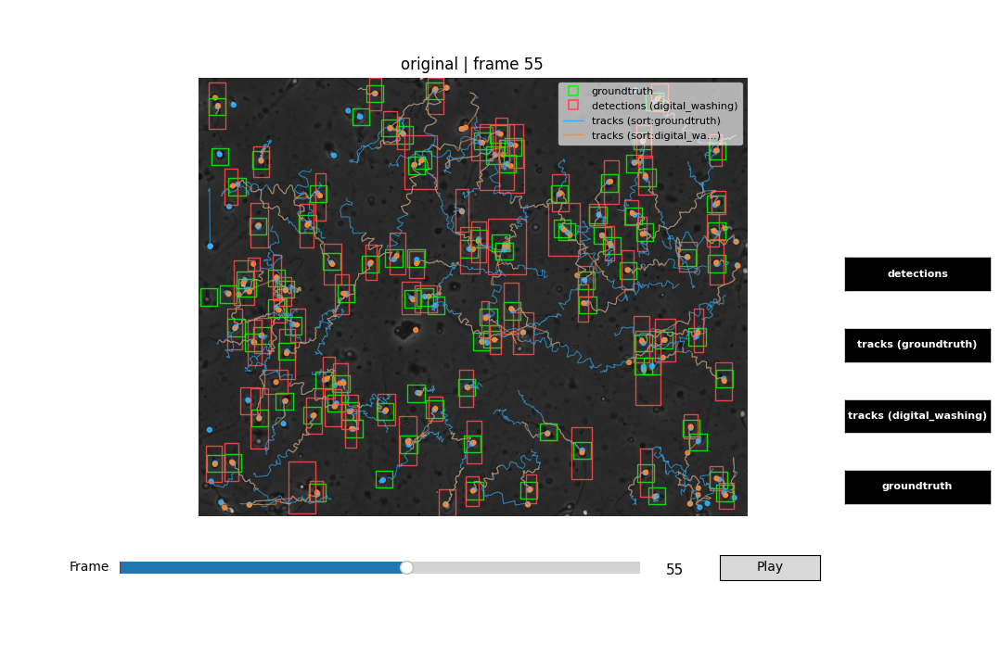

# Example: Detection + SORT Tracking

This workflow shows how to go from raw video frames to frame-linked sperm trajectories. Detection identifies candidate cells per frame; SORT tracking connects those detections across time into continuous tracks that downstream motility analysis can operate on.

## Install

```bash
pip install "pycasa[io,detection,tracking] @ git+https://github.com/DFL-KamLab/pycasa.git"
```

Add `[yolo]` to the extras list if you want to use the YOLO backend (YOLOv5 or YOLO26).

---

## Choose a detection backend

pycasa provides three detection methods. Pick the one that fits your data and computational constraints.

=== "Moving Cells (background subtraction)"

    Lightweight, no deep-learning dependencies. Uses OpenCV or a pure NumPy/SciPy Gaussian-mixture model to extract foreground blobs.

    ```python
    import pycasa as pc

    self = pc.io.load_default_data()
    self.detection.detect_moving_cells(
        method="cv-mog2",           # cv-gmg | cv-mog | cv-mog2 | gm
        number_training_frames=20,  # warm-up frames (no detections produced)
        blob_min_pixel_area=20,     # discard blobs smaller than this
    )
    ```

=== "Digital Washing"

    Combines Gaussian-mixture motion extraction with log-filter binarization and Hu-moment shape classification. More selective than simple background subtraction.

    ```python
    import pycasa as pc

    self = pc.io.load_default_data()
    self.detection.digital_washing(
        motion_threshold=3.0,       # sigma threshold for motion extraction
        number_training_frames=20,
        blob_min_pixel_area=20,
        k_val=1.7,                  # feature-distribution width multiplier
        border_margin_px=20,        # discard detections within this border
    )
    ```

=== "YOLO (v5 / v26)"

    Deep-learning detection using weights trained on CASA semen analysis data. Highest recall for well-resolved sperm cells. Requires `[yolo]` extra. Pass `yolo_model="yolov5"` (default) or `yolo_model="yolo26"` to pick the architecture.

    ```python
    import pycasa as pc

    self = pc.io.load_default_data()
    self.detection.yolo(
        yolo_model="yolov5",             # "yolov5" (default) or "yolo26"
        weights="sys-casa_yolov5s.pt",   # managed weight name or local .pt path
        conf=0.15,                        # confidence threshold
    )
    ```

!!! tip "See also"
    `self.detection.urbano_detection(...)` is a classical Laplacian-of-Gaussian segmentation pipeline (Urbano et al. 2017) — full parameters on the [Detection API page](../api/detection.md#selfdetectionurbano_detection).

---

## Run SORT tracking

Once detections are in the session, run SORT to link them into trajectories:

```python
self.tracking.sort(
    max_age=25,          # frames a track can coast without a match before being dropped
    min_hits=3,          # consecutive hits required before a new track is confirmed
    iou_threshold=0.1,   # IoU overlap needed to associate a detection to an existing track
    skip_gt=False,       # also run SORT on groundtruth detections (if loaded)
)
```

!!! tip "Re-run sort after changing detection"
    Tracks are keyed to the detection source they were built from. If you switch detection backends (e.g., from `moving_cells` to `yolo`), re-run `self.tracking.sort()` to regenerate tracks from the new detections.

!!! tip "Other tracking backends"
    `self.tracking.deepsort(...)` (SORT + appearance features) and `self.tracking.jpdaf(...)` (Joint Probabilistic Data Association, Urbano et al. 2017) are drop-in alternatives that write to the same `casa["tracks"]` schema. See the [Tracking API page](../api/tracking.md) for parameters and recommended settings.

---

## Output preview

<div class="screenshot" markdown>


*`timelapse(show_detections=True, show_tracks=True)` — SORT trajectories drawn as path lines up to the current frame, with bounding-box detections.*

</div>

---

## Complete script

```python
import pycasa as pc

self = pc.io.load_default_data()
self.detection.detect_moving_cells(method="cv-mog2")
self.tracking.sort(max_age=25, min_hits=3, iou_threshold=0.1)
self.info()
```

---

## Inspecting results

```python
# Confirm detections exist
detections = self.get_detections()
print(f"Frames with detections: {len(detections)}")

# Inspect SORT tracks
tracks = self.get_tracks(backend="sort")

# tracks is a dict keyed by source name ("moving_cells", "yolov5", "groundtruth", ...)
for source, source_tracks in tracks.items():
    print(f"\nSource: {source}  |  Tracks: {len(source_tracks)}")
    for track_id, frames in list(source_tracks.items())[:3]:  # show first 3 tracks
        print(f"  track {track_id}: {len(frames)} frames, "
              f"first={min(frames)}, last={max(frames)}")
```

---

## What to try next

- [Motility + Assessment](motility-assessment.md) — compute VCL, VSL, VAP, and other CASA metrics from these tracks.
- [Visualization API](../api/visualization.md) — use `timelapse(show_tracks=True)` to browse the trajectories overlaid on the video.
