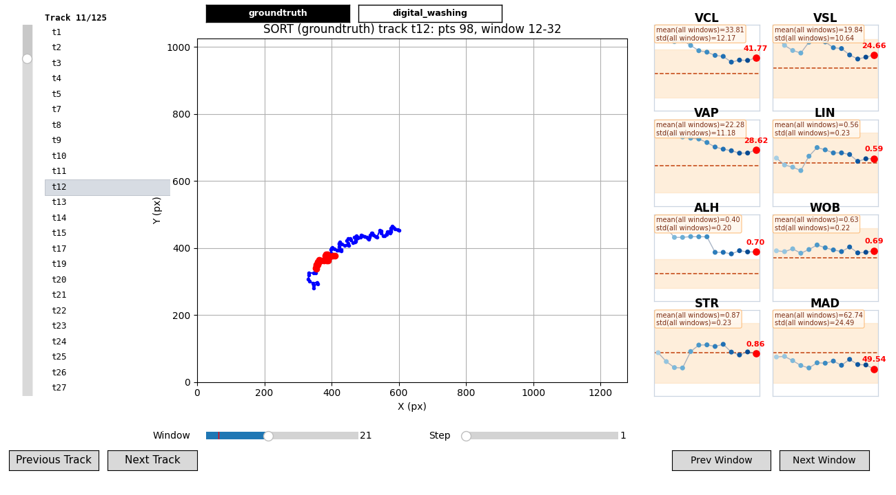

# Example: Motility + Assessment

This example shows the full analytical half of the pycasa pipeline: computing standard CASA motility parameters from SORT trajectories, and scoring your results against groundtruth. pycasa offers **two** assessments, which answer different questions:

- **`evaluate_detections()`** — did the detector find the cells? Scores predicted detections against groundtruth detections (precision / recall / F1).
- **`evaluate_tracks()`** — did the tracker preserve identities? Compares every track set against every other and reports MOT-style identity metrics (MOTA / IDF1).

Both live under `self.assessment` and coexist in `casa["assessment"]`.

## Install

```bash
pip install "pycasa[io,detection,tracking] @ git+https://github.com/DFL-KamLab/pycasa.git"
```

---

## Complete script

```python
import pycasa as pc

# 1. Load default data (includes groundtruth annotations)
self = pc.io.load_default_data()

# 2. Detect and track
self.detection.detect_moving_cells(method="cv-mog2")
self.tracking.sort()

# 3. Set pixel-to-micron calibration before motility computation
self.set_um_per_px(0.24)   # µm per pixel — adjust to match your microscope setup

# 4. Compute standard CASA motility metrics
self.motility.kinematic_parameters(
    window_size=10,    # trajectory points per sliding window
    overlap=0.2,       # fraction of window that overlaps with the previous window
)

# 5. Score predicted detections against groundtruth detections
self.assessment.evaluate_detections(match_min_distance_pixel=20)

self.info()
```

---

## Output preview

<div class="screenshot" markdown>


*`motility_radar()` — spider chart of aggregate motility metric means across all active SORT tracks.*

</div>

<div class="screenshot" markdown>


*`interactive_motility_calculator()` — per-track window explorer with VCL, VSL, VAP, LIN, ALH, WOB, STR, and MAD history tiles.*

</div>

---

## Motility metrics reference

`kinematic_parameters` computes these eight metrics per sliding window over each track:

| Metric | Full Name | Unit | What it measures |
|--------|-----------|------|-----------------|
| **VCL** | Curvilinear Velocity | µm/s | Speed along the actual curvilinear path. |
| **VSL** | Straight-Line Velocity | µm/s | Net displacement speed (first → last point). |
| **VAP** | Average Path Velocity | µm/s | Speed along the smoothed mean path. |
| **LIN** | Linearity | — | `VSL / VCL`. Near 1 = highly linear motion. |
| **ALH** | Amplitude of Lateral Head Displacement | µm | Half-range of lateral oscillations around the mean path. |
| **WOB** | Wobble | — | `VAP / VCL`. Deviation from the mean path. |
| **STR** | Straightness | — | `VSL / VAP`. Straightness of the mean path. |
| **MAD** | Mean Angular Displacement | degrees | Average turning angle per frame step. |

!!! note "Unit conversion"
    Velocity metrics (VCL, VSL, VAP) and ALH are reported in **µm/s** and **µm** when `um_per_px` is set and `conversion_required=True` (the default). Without calibration they remain in pixel units. Set calibration with `self.set_um_per_px(value)` before calling `kinematic_parameters()`.

---

## Reading the motility output

```python
motility = self.get_motility()

# Output is keyed by detection source → track_id → metric → list of per-window values
source = "moving_cells"   # or "yolov5", "groundtruth", etc.
track_motility = motility["kinematic_parameters"][source]

# Inspect one track
for track_id, params in list(track_motility.items())[:2]:
    vcl_windows = params["VCL"]   # one float per sliding window
    vsl_windows = params["VSL"]
    print(f"Track {track_id}: {len(vcl_windows)} windows, "
          f"mean VCL={sum(vcl_windows)/len(vcl_windows):.1f} µm/s")
    print(f"  frame_ranges: {params['frame_ranges']}")
```

The output structure:

```python
{
    "kinematic_parameters": {
        "moving_cells": {
            42: {
                "VCL": [38.2, 40.1, 37.8],   # one value per window
                "VSL": [22.4, 24.0, 21.9],
                "VAP": [30.1, 31.5, 29.8],
                "LIN": [0.59, 0.60, 0.58],
                "ALH": [1.8, 1.9, 1.7],
                "WOB": [0.79, 0.79, 0.80],
                "STR": [0.74, 0.76, 0.73],
                "MAD": [18.3, 17.9, 19.1],
                "frame_ranges": "0-9, 8-17, 16-25",
            },
            ...
        }
    }
}
```

---

## CASA parameters (WHO motility grades)

`casa_parameters()` aggregates the per-track kinematics above into population-level clinical parameters. It classifies every track into one of the four WHO grades and reports their percentages; with optional physical inputs it also reports concentration, volume, and total sperm count.

```python
# Run kinematics first, then aggregate to CASA parameters.
self.motility.kinematic_parameters()

# Grades only (always available):
self.motility.casa_parameters()

# Grades + concentration + total count (provide the physical inputs):
self.motility.casa_parameters(volume_ml=3.5, chamber_depth_um=20)
# ...equivalently set them on the session once:
# self.set_volume_ml(3.5); self.set_chamber_depth_um(20)
```

Reading the output:

```python
casa = self.get_motility()["casa_parameters"][source]   # source e.g. "yolov5"
print(casa["grades"])                 # {'rapid':.., 'slow':.., 'non_progressive':.., 'immotile':..}
print(casa["grades_std"])             # binomial standard error (percentage points) per grade
print(casa["percent_motile"])         # 100 - %immotile
print(casa["concentration_M_per_ml"]) # 10^6/mL, or None if inputs absent
print(casa["total_sperm_count_M"])    # 10^6, or None
```

| Parameter | Needs | Meaning |
|-----------|-------|---------|
| `grades.rapid` | — | Progressive & velocity ≥ `rapid_threshold` (default 25 µm/s), WHO grade a. |
| `grades.slow` | — | Progressive & velocity < `rapid_threshold`, WHO grade b. |
| `grades.non_progressive` | — | Motile but `STR` < `progressive_str_threshold` (0.8), WHO grade c. |
| `grades.immotile` | — | Velocity < `immotile_threshold` (5 µm/s), WHO grade d. |
| `concentration_M_per_ml` | `um_per_px` (`chamber_depth_um` defaults to 20) | Mean cells/frame ÷ (field area × depth). |
| `volume_ml` | `volume_ml` | Ejaculate volume (manual lab measurement). |
| `total_sperm_count_M` | volume + concentration | `volume_ml × concentration`. |

!!! note "Thresholds are adjustable"
    Defaults follow WHO conventions but every threshold is an argument:
    `casa_parameters(rapid_threshold=25, immotile_threshold=5, progressive_str_threshold=0.8, velocity_metric="VAP")`.
    Velocity thresholds are in µm/s, so set `um_per_px` first for meaningful grades.

---

## Reading the detection assessment output

!!! note "Groundtruth requirement"
    `evaluate_detections()` compares predicted detections against groundtruth **detections**. The default dataset includes groundtruth detection annotations. For custom videos, pass `groundtruth_detections_path=...` to `load_video()`.

```python
assessment = self.get_assessment()
clf = assessment["detection"]

print(f"True positives  : {clf['tp']}")
print(f"False positives : {clf['fp']}")
print(f"False negatives : {clf['fn']}")
print(f"Precision       : {clf['precision']:.1f}%")
print(f"Recall          : {clf['recall']:.1f}%")
print(f"F1 score        : {clf['F1']:.1f}%")
print(f"Evaluated frames: {clf['evaluated_frames']}")
```

| Metric | Definition |
|--------|-----------|
| `tp` | Predicted detections matched to a groundtruth within the distance threshold. |
| `fp` | Predicted detections with no close groundtruth match. |
| `fn` | Groundtruth detections with no close predicted match. |
| `precision` | `tp / (tp + fp)` as a percentage. |
| `recall` | `tp / (tp + fn)` as a percentage. |
| `F1` | Harmonic mean of precision and recall as a percentage. |
| `evaluated_frames` | Frames where both predicted and groundtruth detections were present. |

---

## Track assessment (MOTA / IDF1)

`evaluate_tracks()` evaluates **identity preservation** — whether a tracker keeps one consistent ID per cell over time. It collects every track set in the session (imported groundtruth tracks plus each source of the active tracking backend) and computes MOT metrics for **every ordered pair**.

!!! note "Groundtruth tracks requirement"
    You need **at least two track sets**. Imported groundtruth **tracks** (loaded via `load_video(..., groundtruth_tracks_path=...)`) are what make the numbers true *accuracy*; without them the pairs are tracker-to-tracker *agreement* only. This is separate from the groundtruth *detections* used by `evaluate_detections()`. The optional `motmetrics` dependency is installed on demand.

```python
import pycasa as pc

BASE = r"path/to/Train/60"

# Load a video with BOTH groundtruth detections and groundtruth tracks
self = pc.io.load_video(
    BASE + r"/60.mp4",
    groundtruth_detections_path=BASE + r"/labels",       # per-frame: label cx cy w h
    groundtruth_tracks_path=BASE + r"/labels_ftid",       # per-frame: track_id label cx cy w h
    um_per_px=0.24,
)

# Produce predicted tracks. Running SORT on the groundtruth detections isolates
# tracker-only error; running it on YOLO detections measures the full pipeline.
self.tracking.sort()                       # -> source "sort:groundtruth"
self.detection.yolo(yolo_model="yolov5")
self.tracking.sort()                       # -> source "sort:yolov5"

# Compare all track sets against each other
self.assessment.evaluate_tracks(match_min_distance_pixel=20)
```

This prints a MOTA matrix, an IDF1 matrix, and an "Accuracy vs truth" summary. `info()` shows the same matrices in the `[assessment]` block.

### Reading the track assessment output

```python
tracking = self.get_assessment()["tracking"]

print("track sets :", tracking["sources"])        # e.g. ['groundtruth_tracks', 'sort:groundtruth', 'sort:yolov5']
print("reference  :", tracking["reference"])       # 'groundtruth_tracks' (the true identities)
print("track count:", tracking["track_counts"])    # cells per set

# Results are a matrix: pairs[ground_truth_role][prediction_role] -> metrics
truth = tracking["reference"]
for hyp, m in tracking["pairs"][truth].items():
    print(f"{hyp}: MOTA={m['MOTA']}%, IDF1={m['IDF1']}%, "
          f"switches={m['num_switches']}, fp={m['num_false_positives']}, "
          f"fn={m['num_misses']}, frags={m['num_fragmentations']}")
```

| Metric | Definition |
|--------|-----------|
| `MOTA` | Multi-Object Tracking Accuracy: `1 - (FN + FP + ID-switches) / groundtruth` as a percentage. Overall per-frame correctness. **Role-dependent** — `MOTA(A,B) ≠ MOTA(B,A)`. |
| `IDF1` | Identity F1: harmonic mean of identity precision and recall from a global identity matching. How faithfully each cell keeps a single ID. **Symmetric.** |
| `num_switches` | Times a tracked identity is reassigned to a different groundtruth cell (ID-switches). |
| `num_false_positives` (fp) | Predicted track points with no matching groundtruth. |
| `num_misses` (fn) | Groundtruth track points with no matching prediction. |
| `num_fragmentations` (frags) | Times a groundtruth track's coverage is interrupted then resumed. |
| `MOTP` | Mean matched center-to-center distance (pixels) — localization precision. |

!!! tip "Which row matters"
    Only the **`groundtruth_tracks` row** is true accuracy. The gap between `sort:groundtruth` (SORT on perfect detections — tracker-only error) and `sort:yolov5` (full pipeline) is the accuracy lost to detection errors. Off-diagonal rows are tracker-to-tracker agreement: read their **IDF1** (symmetric), not their MOTA.

---

## What to try next

- [Visualization API](../api/visualization.md) — use `motility_radar()` and `motility_density_scatter()` to plot aggregate metric summaries.
- [Interactive motility calculator](../api/visualization.md) — explore per-track, per-window metric histories in an interactive panel.
- [Assessment API](../api/assessment.md) — full parameter reference for `evaluate_detections()` and `evaluate_tracks()`.
