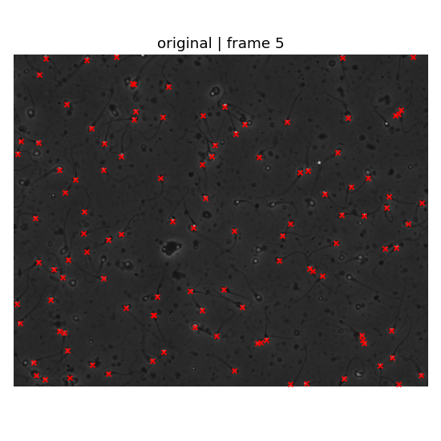
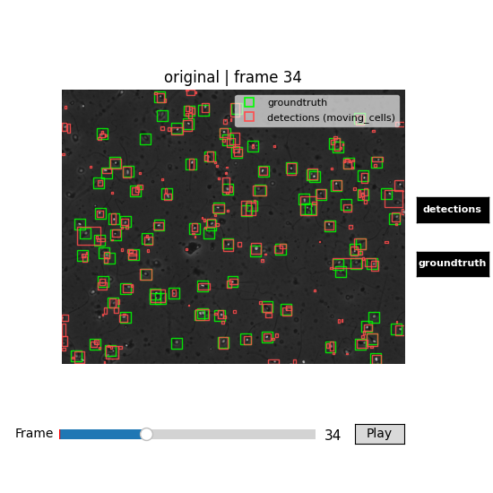
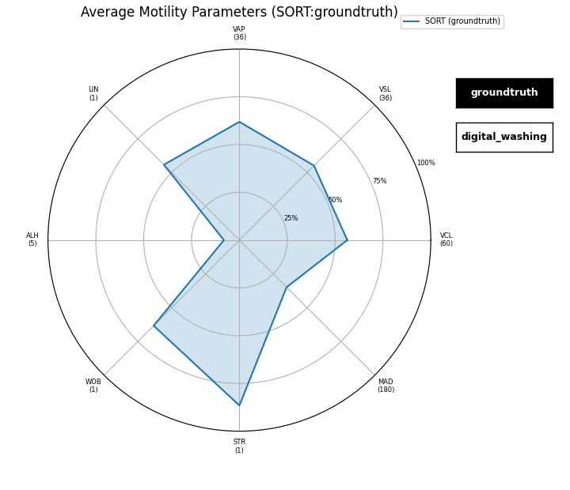

<p align="center">
  
</p>

<p align="center">
  <em>A Python toolkit for computer-assisted semen analysis — from raw video to motility metrics in a single fluent pipeline.</em>
</p>

<p align="center">
  <strong>Version 0.0.1</strong>
</p>

---

## Install

```bash
pip install "pycasa[io,detection,tracking,yolo] @ git+https://github.com/DFL-KamLab/pycasa.git"
```

---

## What pycasa gives you

<div class="grid cards" markdown>

-   :material-link-variant:{ .lg .middle } **Fluent pipeline API**

    ---

    Every method returns the same `Casa` session object, so you can chain steps in a single readable expression — or call them one at a time during exploration.

    [:octicons-arrow-right-24: Casa Session Model](api/casa-session.md)

-   :material-magnify:{ .lg .middle } **Multiple detection methods**

    ---

    Choose from several detection methods — from classical background-subtraction approaches to deep-learning-based detectors trained on CASA semen data.

    [:octicons-arrow-right-24: Detection API](api/detection.md)

-   :material-chart-timeline-variant:{ .lg .middle } **Multi-object tracking**

    ---

    Link detections across frames into per-track trajectories using supported tracking algorithms. Trajectories are frame-indexed and ready for downstream motility analysis.

    [:octicons-arrow-right-24: Tracking API](api/tracking.md)

-   :material-speedometer:{ .lg .middle } **Standard CASA motility metrics**

    ---

    Motility parameters widely used in sperm cell studies can be calculated effortlessly — using a sliding-window approach on tracked trajectories with micron-unit output when pixel calibration is set.

    [:octicons-arrow-right-24: Motility API](api/motility.md)

-   :material-video-box:{ .lg .middle } **Interactive visualization**

    ---

    Browse frames with a timelapse scrubber, toggle detection and track overlays, and explore per-track motility windows in an interactive calculator panel.

    [:octicons-arrow-right-24: Visualization API](api/visualization.md)

-   :material-database:{ .lg .middle } **Open default dataset**

    ---

    `load_default_data()` fetches a ready-to-use subset of the HC004 semen analysis dataset from HuggingFace on first run — no manual downloads required.

    [:octicons-arrow-right-24: I/O API](api/io.md)

</div>

---

## Examples

<div class="example-gallery">

  <a href="examples/default-data-otsu-yolo/" class="example-card" style="text-decoration:none">
    
    <div class="card-img-placeholder" style="display:none">screenshot coming soon</div>
    <div class="card-body">
      <p class="card-title">Default Data + Otsu + YOLO</p>
      <p class="card-desc">Load the built-in HC004 dataset, binarize with Otsu thresholding, and run YOLOv5 detection — no local files needed.</p>
      <span class="card-link">View example →</span>
    </div>
  </a>

  <a href="examples/custom-video/" class="example-card" style="text-decoration:none">
    
    <div class="card-img-placeholder" style="display:none">screenshot coming soon</div>
    <div class="card-body">
      <p class="card-title">Load Custom Video</p>
      <p class="card-desc">Load your own AVI or MP4 microscopy video with custom frame ranges, calibration, and optional groundtruth annotations.</p>
      <span class="card-link">View example →</span>
    </div>
  </a>

  <a href="examples/detection-tracking/" class="example-card" style="text-decoration:none">
    
    <div class="card-img-placeholder" style="display:none">screenshot coming soon</div>
    <div class="card-body">
      <p class="card-title">Detection + SORT Tracking</p>
      <p class="card-desc">Compare detection methods and link detections into frame-indexed trajectories using available tracking algorithms.</p>
      <span class="card-link">View example →</span>
    </div>
  </a>

  <a href="examples/motility-assessment/" class="example-card" style="text-decoration:none">
    
    <div class="card-img-placeholder" style="display:none">screenshot coming soon</div>
    <div class="card-body">
      <p class="card-title">Motility + Assessment</p>
      <p class="card-desc">Compute standard CASA motility metrics and score detector precision, recall, and F1 against groundtruth.</p>
      <span class="card-link">View example →</span>
    </div>
  </a>

</div>

---

## Pipeline at a glance

A complete pycasa workflow fits in a single script:

```python
import pycasa as pc

# 1. Load video (or use the built-in default dataset)
self = pc.io.load_default_data()

# 2. Preprocess — convert to grayscale and binarize
self.preprocessing.grayscale()
self.preprocessing.binarization.otsu()

# 3. Detect — run YOLO on every frame (defaults to YOLO26; pass yolo_model="yolov5" for YOLOv5)
self.detection.yolo()

# 4. Track — link detections into trajectories with SORT
#    (deepsort or jpdaf are drop-in alternatives — see the Tracking API page)
self.tracking.sort()

# 5. Motility — per-track kinematics, then population WHO grades
#    um_per_px is auto-set to 0.24 by load_default_data(); call self.set_um_per_px(...) only for custom videos
self.motility.kinematic_parameters()   # VCL, VSL, VAP, LIN, ALH, WOB, STR, MAD
self.motility.casa_parameters()        # %rapid/%slow/%non-progressive/%immotile (+ conc/volume if set)

# 6. Assess — compare predictions against groundtruth
self.assessment.evaluate_detections()   # detections vs GT detections (precision/recall/F1)
# self.assessment.evaluate_tracks()     # tracks vs GT tracks (MOTA/IDF1) — needs
#                                      # load_video(..., groundtruth_tracks_path=...)

# 7. Visualize — browse frames with overlays
self.visualization.timelapse(video_type="original", show_detections=True, show_tracks=True)
```

---

## Where to go next

<div class="grid" markdown>

<div markdown>
**New to pycasa?**

Start with installation and your first working pipeline.

- [Setup & Requirements](getting-started/setup.md)
- [Quickstart](getting-started/quickstart.md)
</div>

<div markdown>
**Looking for examples?**

End-to-end workflow scripts for common scenarios.

- [Default Data + Otsu + YOLO](examples/default-data-otsu-yolo.md)
- [Load Custom Video](examples/custom-video.md)
- [Detection + SORT Tracking](examples/detection-tracking.md)
- [Motility + Assessment](examples/motility-assessment.md)
</div>

<div markdown>
**Need method details?**

Full parameter tables, return types, and raised exceptions.

- [Casa Session Model](api/casa-session.md)
- [I/O](api/io.md)
- [Preprocessing](api/preprocessing.md)
- [Detection](api/detection.md)
</div>

</div>
